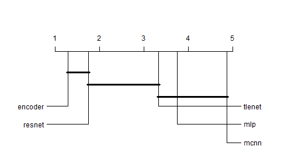

# cdg
## Critical Difference Generator
#### Lancaster University 2021


[](https://travis-ci.com/K-Molloy/cdg)


There are a few current implementations of the critical difference diagram in R, however, they are either unsupported in newer versions on R or take proprietary inputs so that led to this.


## Installation
```
# Or the development version from GitHub:
# install.packages("devtools")
devtools::install_github("K-Molloy/cdg")

# Not yet Supported
# Install devtools from CRAN
# install.packages("cdg")
```

## Usage
THe premise of cdg is simple: perform your classification algorithms in whichever environment you prefer and save them to a csv. cdg will then perform statistical comparisons to evaluate if they differ significantly and then produce a pretty graph. Here is a simple example:
```
# Load data into workspace
data(scc413)
# Create critical difference diagram
criticalDifferenceDiagram(scc413)
```
Which results in the following graph


## Road Map

- More methods and bug fixes for now